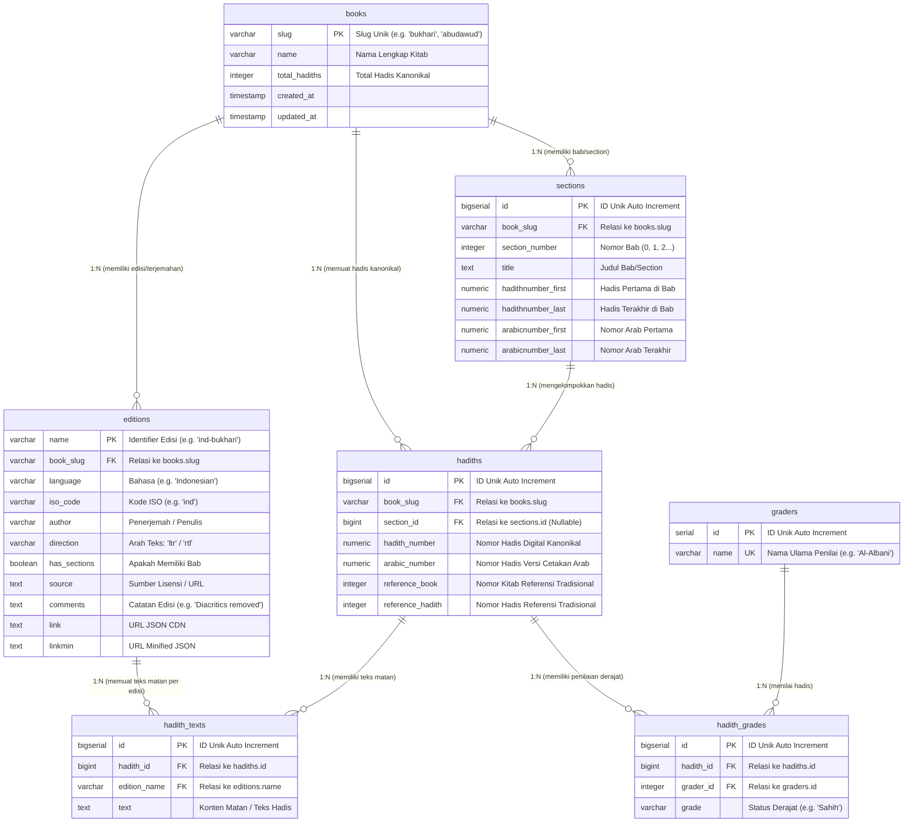

# Skema Database Hadis (Hadith Database Schema)
Berdasarkan Repositori Data: [fawazahmed0/hadith-api](https://github.com/fawazahmed0/hadith-api)

Dokumen ini berisi rancangan skema database relasional (PostgreSQL / MySQL / SQLite) yang dirancang secara terstruktur dan ter-normalisasi berdasarkan arsitektur data dari **Hadith API (fawazahmed0/hadith-api)** dan diselaraskan dengan glosarium domain pada `CONTEXT.md`.

---

## 1. Analisis Struktur Data & Pemetaan Domain

Berdasarkan analisis file metadata (`info.json`), indeks edisi (`editions.json`), file edisi (`editions/*.json`), serta skrip pembangkit API (`apiscript.js`), struktur data `hadith-api` terdiri dari entitas utama berikut:

1. **Books (Koleksi Kitab Hadis)**: Koleksi kitab utama seperti `bukhari`, `muslim`, `abudawud`, `tirmidhi`, `nasai`, `ibnmajah`, `malik`, `nawawi`, `qudsi`, `dehlawi`.
2. **Sections (Bab / Bagian Kitab)**: Pembagian tematis dalam kitab (contoh: *Purification*, *Prayer*) beserta jangkauan nomor hadis (*hadithnumber_first*, *hadithnumber_last*, *arabicnumber_first*, *arabicnumber_last*).
3. **Editions (Edisi & Terjemahan)**: Publikasi teks hadis berdasarkan bahasa (terjemahan seperti `ind-bukhari`, `eng-bukhari`) maupun varian teks Arab (`ara-bukhari` ber-harakat dan `ara-bukhari1` gundul/tanpa harakat). Memiliki metadata bahasa, ISO code, arah teks (`rtl`/`ltr`), penerjemah, dan catatan edisi.
4. **Hadiths (Entitas Kanonikal Hadis)**: Record utama unit hadis yang menyimpan penomoran digital kanonikal (`hadith_number`), penomoran Arab (`arabic_number`), serta referensi kitab tradisional (`reference_book` dan `reference_hadith`).
5. **Hadith Texts (Matan / Teks Hadis per Edisi)**: Konten teks matan hadis dalam berbagai edisi/bahasa.
6. **Graders (Ulama / Muhaddits Penilai Hadis)**: Tokoh/ulama penilai derajat hadis (contoh: *Al-Albani*, *Muhammad Muhyi Al-Din Abdul Hamid*, *Zubair Ali Zai*, *Shuaib Al Arnaut*).
7. **Hadith Grades (Derajat Keshahihan Hadis)**: Status penilaian keshahihan hadis (contoh: *Sahih*, *Hasan*, *Daif*) untuk hadis tertentu oleh ulama penilai tertentu.

---

## 2. Diagram Hubungan Entitas (Mermaid ERD)



---

## 3. Spesifikasi DDL (Data Definition Language) SQL

Skema berikut menggunakan sintaks PostgreSQL (produksi) dengan dukungan **Trigram Index (`pg_trgm`)** untuk pencarian kata kunci multi-bahasa (Indonesia, Arab, Inggris, Bengali, Urdu, dll.).

```sql
-- Mengaktifkan ekstensi pg_trgm untuk pencarian teks multi-bahasa yang cepat
CREATE EXTENSION IF NOT EXISTS pg_trgm;

-- =============================================================================
-- 1. TABEL BOOKS (Koleksi Kitab Hadis Utama)
-- =============================================================================
CREATE TABLE books (
    slug VARCHAR(50) PRIMARY KEY,
    name VARCHAR(255) NOT NULL,
    total_hadiths INTEGER NOT NULL DEFAULT 0,
    created_at TIMESTAMPTZ DEFAULT CURRENT_TIMESTAMP,
    updated_at TIMESTAMPTZ DEFAULT CURRENT_TIMESTAMP
);

COMMENT ON TABLE books IS 'Koleksi utama kitab hadis (contoh: bukhari, muslim, abudawud)';
COMMENT ON COLUMN books.slug IS 'Identifier unik slug kitab (e.g. bukhari, abudawud)';
COMMENT ON COLUMN books.total_hadiths IS 'Jumlah total hadis kanonikal dalam kitab';

-- =============================================================================
-- 2. TABEL SECTIONS (Bab / Bagian Kitab)
-- =============================================================================
CREATE TABLE sections (
    id BIGSERIAL PRIMARY KEY,
    book_slug VARCHAR(50) NOT NULL REFERENCES books(slug) ON DELETE CASCADE,
    section_number INTEGER NOT NULL,
    title TEXT NOT NULL DEFAULT '',
    hadithnumber_first NUMERIC(10, 2),
    hadithnumber_last NUMERIC(10, 2),
    arabicnumber_first NUMERIC(10, 2),
    arabicnumber_last NUMERIC(10, 2),
    created_at TIMESTAMPTZ DEFAULT CURRENT_TIMESTAMP,
    CONSTRAINT uk_sections_book_number UNIQUE (book_slug, section_number)
);

CREATE INDEX idx_sections_book_slug ON sections(book_slug);

COMMENT ON TABLE sections IS 'Daftar bab/bagian tematis pada tiap kitab hadis';

-- =============================================================================
-- 3. TABEL EDITIONS (Edisi Teks & Bahasa Terjemahan Hadis)
-- =============================================================================
CREATE TABLE editions (
    name VARCHAR(100) PRIMARY KEY,
    book_slug VARCHAR(50) NOT NULL REFERENCES books(slug) ON DELETE CASCADE,
    language VARCHAR(50) NOT NULL,
    iso_code VARCHAR(10) NOT NULL,
    author VARCHAR(255) NOT NULL DEFAULT 'Unknown',
    direction VARCHAR(3) NOT NULL CHECK (direction IN ('ltr', 'rtl')),
    has_sections BOOLEAN NOT NULL DEFAULT TRUE,
    source TEXT,
    comments TEXT,
    link TEXT,
    linkmin TEXT,
    created_at TIMESTAMPTZ DEFAULT CURRENT_TIMESTAMP
);

CREATE INDEX idx_editions_book_slug ON editions(book_slug);
CREATE INDEX idx_editions_iso_code ON editions(iso_code);

COMMENT ON TABLE editions IS 'Metadata edisi (terjemahan bahasa maupun varian teks gundul/harakat)';

-- =============================================================================
-- 4. TABEL HADITHS (Entitas Utama Kanonikal Hadis)
-- =============================================================================
CREATE TABLE hadiths (
    id BIGSERIAL PRIMARY KEY,
    book_slug VARCHAR(50) NOT NULL REFERENCES books(slug) ON DELETE CASCADE,
    section_id BIGINT REFERENCES sections(id) ON DELETE SET NULL,
    hadith_number NUMERIC(10, 2) NOT NULL,
    arabic_number NUMERIC(10, 2),
    reference_book INTEGER,
    reference_hadith INTEGER,
    created_at TIMESTAMPTZ DEFAULT CURRENT_TIMESTAMP,
    CONSTRAINT uk_hadiths_book_number UNIQUE (book_slug, hadith_number)
);

CREATE INDEX idx_hadiths_book_slug ON hadiths(book_slug);
CREATE INDEX idx_hadiths_section_id ON hadiths(section_id);
CREATE INDEX idx_hadiths_number ON hadiths(hadith_number);

COMMENT ON TABLE hadiths IS 'Record induk hadis kanonikal (nomor hadis digital & referensi cetakan)';

-- =============================================================================
-- 5. TABEL HADITH_TEXTS (Konten / Matan Hadis per Edisi)
-- =============================================================================
CREATE TABLE hadith_texts (
    id BIGSERIAL PRIMARY KEY,
    hadith_id BIGINT NOT NULL REFERENCES hadiths(id) ON DELETE CASCADE,
    edition_name VARCHAR(100) NOT NULL REFERENCES editions(name) ON DELETE CASCADE,
    text TEXT NOT NULL,
    created_at TIMESTAMPTZ DEFAULT CURRENT_TIMESTAMP,
    CONSTRAINT uk_hadith_texts_hadith_edition UNIQUE (hadith_id, edition_name)
);

CREATE INDEX idx_hadith_texts_hadith_id ON hadith_texts(hadith_id);
CREATE INDEX idx_hadith_texts_edition_name ON hadith_texts(edition_name);

-- Indeks GIN Trigram untuk pencarian kata kunci multi-bahasa (Indonesia, Arab, Inggris, dll.)
CREATE INDEX idx_hadith_texts_trgm ON hadith_texts USING gin(text gin_trgm_ops);

COMMENT ON TABLE hadith_texts IS 'Matan / teks hadis untuk edisi & bahasa tertentu';

-- =============================================================================
-- 6. TABEL GRADERS (Penilai / Muhaddits / Ulama Hadis)
-- =============================================================================
CREATE TABLE graders (
    id SERIAL PRIMARY KEY,
    name VARCHAR(150) NOT NULL UNIQUE
);

COMMENT ON TABLE graders IS 'Master data ulama/muhaddits penilai derajat hadis';

-- =============================================================================
-- 7. TABEL HADITH_GRADES (Derajat Keshahihan Hadis)
-- =============================================================================
CREATE TABLE hadith_grades (
    id BIGSERIAL PRIMARY KEY,
    hadith_id BIGINT NOT NULL REFERENCES hadiths(id) ON DELETE CASCADE,
    grader_id INTEGER NOT NULL REFERENCES graders(id) ON DELETE CASCADE,
    grade VARCHAR(255) NOT NULL,
    created_at TIMESTAMPTZ DEFAULT CURRENT_TIMESTAMP,
    CONSTRAINT uk_hadith_grades_hadith_grader UNIQUE (hadith_id, grader_id)
);

CREATE INDEX idx_hadith_grades_hadith_id ON hadith_grades(hadith_id);
CREATE INDEX idx_hadith_grades_grader_id ON hadith_grades(grader_id);
CREATE INDEX idx_hadith_grades_grade ON hadith_grades(grade);

COMMENT ON TABLE hadith_grades IS 'Penilaian derajat hadis oleh masing-masing ulama penilai';
```

---

## 4. Pemetaan Data JSON (`hadith-api`) ke Tabel SQL

Tabel berikut memperlihatkan pemetaan (*mapping*) dari struktur JSON API `fawazahmed0/hadith-api` ke dalam tabel database relasional:

### 4.1 Pemetaan `editions.json` ➔ Tabel `books` & `editions`

| Field JSON (`editions.json`) | Tabel Target | Kolom SQL Target | Tipe Data SQL | Catatan Pemetaan |
|---|---|---|---|---|
| Key `abudawud`, `bukhari` | `books` | `slug` | `VARCHAR(50)` | Slug Unik Kitab |
| `name` (e.g. "Sunan Abu Dawud") | `books` | `name` | `VARCHAR(255)` | Nama Kitab Utama |
| Collection item `name` (e.g. "ind-abudawud") | `editions` | `name` | `VARCHAR(100)` | Identifier Edisi |
| Collection item `book` | `editions` | `book_slug` | `VARCHAR(50)` | FK ke `books.slug` |
| Collection item `author` | `editions` | `author` | `VARCHAR(255)` | Penerjemah / Penulis |
| Collection item `language` | `editions` | `language` | `VARCHAR(50)` | Bahasa Edisi |
| Derived ISO code (e.g. "ind") | `editions` | `iso_code` | `VARCHAR(10)` | Kode ISO Bahasa |
| Collection item `has_sections` | `editions` | `has_sections` | `BOOLEAN` | Status Struktur Bab |
| Collection item `direction` | `editions` | `direction` | `VARCHAR(3)` | 'ltr' atau 'rtl' |
| Collection item `source` | `editions` | `source` | `TEXT` | URL / Lisensi Sumber |
| Collection item `comments` | `editions` | `comments` | `TEXT` | Catatan (misal "Diacritics removed") |
| Collection item `link` | `editions` | `link` | `TEXT` | URL JSON Original CDN |
| Collection item `linkmin` | `editions` | `linkmin` | `TEXT` | URL JSON Minified CDN |

### 4.2 Pemetaan `info.json` ➔ Tabel `sections` & `books`

| Field JSON (`info.json`) | Tabel Target | Kolom SQL Target | Tipe Data SQL | Catatan Pemetaan |
|---|---|---|---|---|
| `metadata.last_hadithnumber` | `books` | `total_hadiths` | `INTEGER` | Total Hadis Kanonikal |
| `metadata.sections[sectionKey]` | `sections` | `section_number`, `title` | `INTEGER`, `TEXT` | Nomor & Judul Bab |
| `section_details[key].hadithnumber_first` | `sections` | `hadithnumber_first` | `NUMERIC(10,2)` | Nomor Hadis Awal di Bab |
| `section_details[key].hadithnumber_last` | `sections` | `hadithnumber_last` | `NUMERIC(10,2)` | Nomor Hadis Akhir di Bab |
| `section_details[key].arabicnumber_first` | `sections` | `arabicnumber_first` | `NUMERIC(10,2)` | Nomor Arab Awal |
| `section_details[key].arabicnumber_last` | `sections` | `arabicnumber_last` | `NUMERIC(10,2)` | Nomor Arab Akhir |

### 4.3 Pemetaan Hadith Single / Edition JSON ➔ Tabel `hadiths`, `hadith_texts`, `graders`, `hadith_grades`

| Field JSON Hadith | Tabel Target | Kolom SQL Target | Tipe Data SQL | Catatan Pemetaan |
|---|---|---|---|---|
| `hadithnumber` | `hadiths` | `hadith_number` | `NUMERIC(10,2)` | Nomor Unik Kanonikal Digital |
| `arabicnumber` | `hadiths` | `arabic_number` | `NUMERIC(10,2)` | Nomor Cetakan Arab |
| `reference.book` | `hadiths` | `reference_book` | `INTEGER` | Nomor Kitab Referensi |
| `reference.hadith` | `hadiths` | `reference_hadith` | `INTEGER` | Nomor Hadis Referensi |
| `text` | `hadith_texts` | `text` | `TEXT` | Konten Matan Hadis |
| `grades[i].name` | `graders` | `name` | `VARCHAR(150)` | Nama Ulama Muhaddits |
| `grades[i].grade` | `hadith_grades` | `grade` | `VARCHAR(255)` | Status Derajat Keshahihan |

---

## 5. Pertimbangan Desain & Optimalisasi Database

1. **Penerapan Multi-Bahasa yang Ter-normalisasi**:
   - Teks hadis disimpan terpisah pada tabel `hadith_texts` ber-relasi ke `hadiths` dan `editions`. Satu record hadis kanonikal dapat menampung $N$ edisi bahasa (Arab, Indonesia, Inggris, Urdu, Bengali, dll) tanpa duplikasi metadata hadis.
2. **Penggunaan Presisi `NUMERIC(10,2)`**:
   - Skema penomoran hadis digital pada `hadith-api` kerap menyertakan pecahan/desimal (seperti `1.1` atau `1035.1`). Tipe `NUMERIC(10,2)` mencegah *rounding error* yang kerap terjadi pada tipe `FLOAT`.
3. **Optimasi Pencarian Teks Multi-Bahasa dengan Trigram (`pg_trgm`)**:
   - Mengganti indeks `to_tsvector('english')` standar dengan **Trigram Index (`pg_trgm`)** pada `hadith_texts.text`. Hal ini membuat pencarian kata kunci multi-bahasa (`ILIKE '%kata%'`) baik Bahasa Indonesia, Inggris, maupun Arab gundul (`ara-*1`) berjalan sangat cepat.
4. **Variasi Edisi Teks Arab Gundul (`ara-*1`)**:
   - Repository `hadith-api` menyediakan edisi `ara-*1` (tanpa harakat). Edisi ini dapat dimanfaatkan khusus untuk pencarian teks Arab cepat tanpa terganggu oleh harakat/tashkeel.
5. **Penanganan Rentang Bab (`sections`)**:
   - Keterikatan `hadiths.section_id` ke `sections.id` diisi saat impor data awal. Metadata rentang nomor (`hadithnumber_first` & `hadithnumber_last`) tetap disimpan pada `sections` untuk mempercepat query metadata bab tanpa perlu melakukan agregasi `MIN/MAX` secara realtime.

---

## 6. Contoh Query SQL Operasional

### 6.1 Mengambil Hadis Lengkap (Arab + Terjemahan Indonesia + Derajat Ulama)
```sql
SELECT 
    b.name AS kitab,
    h.hadith_number AS nomor_hadis,
    s.title AS nama_bab,
    ht_ara.text AS teks_arab,
    ht_ind.text AS terjemahan_indonesia,
    g.name AS penilai,
    hg.grade AS derajat_hadis
FROM hadiths h
JOIN books b ON h.book_slug = b.slug
LEFT JOIN sections s ON h.section_id = s.id
-- Ambil Teks Arab Berharakat
LEFT JOIN hadith_texts ht_ara ON h.id = ht_ara.hadith_id AND ht_ara.edition_name = 'ara-abudawud'
-- Ambil Teks Terjemahan Indonesia
LEFT JOIN hadith_texts ht_ind ON h.id = ht_ind.hadith_id AND ht_ind.edition_name = 'ind-abudawud'
-- Ambil Derajat Keshahihan Hadis
LEFT JOIN hadith_grades hg ON h.id = hg.hadith_id
LEFT JOIN graders g ON hg.grader_id = g.id
WHERE h.book_slug = 'abudawud' AND h.hadith_number = 1035;
```

### 6.2 Pencarian Kata Kunci Fast Trigram Search pada Matan Hadis
```sql
SELECT 
    b.name AS kitab,
    h.hadith_number,
    e.language,
    ht.edition_name,
    ht.text
FROM hadith_texts ht
JOIN hadiths h ON ht.hadith_id = h.id
JOIN books b ON h.book_slug = b.slug
JOIN editions e ON ht.edition_name = e.name
WHERE ht.text ILIKE '%tashahhud%'
ORDER BY b.slug, h.hadith_number
LIMIT 20;
```

### 6.3 Mengambil Daftar Hadis dalam Bab/Section Tertentu
```sql
SELECT 
    s.section_number,
    s.title AS nama_bab,
    h.hadith_number,
    ht.text AS teks_terjemahan
FROM hadiths h
JOIN sections s ON h.section_id = s.id
JOIN hadith_texts ht ON h.id = ht.hadith_id
WHERE h.book_slug = 'bukhari' 
  AND s.section_number = 2
  AND ht.edition_name = 'ind-bukhari'
ORDER BY h.hadith_number;
```

### 6.4 Menyaring Hadis Berdasarkan Ulama Penilai dan Status "Sahih"
```sql
SELECT 
    b.name AS kitab,
    h.hadith_number,
    hg.grade AS status_derajat,
    g.name AS ulama
FROM hadith_grades hg
JOIN graders g ON hg.grader_id = g.id
JOIN hadiths h ON hg.hadith_id = h.id
JOIN books b ON h.book_slug = b.slug
WHERE g.name = 'Al-Albani' 
  AND hg.grade ILIKE '%Sahih%'
LIMIT 50;
```
